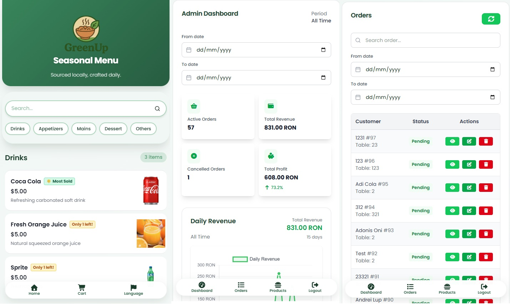

# GreenUp

GreenUp is a QR-code-based restaurant ordering system. Customers scan the QR code on their table to browse the menu, build a cart, and place an order — as a guest or with a registered account. Kitchen staff manage incoming orders in real time, and admins get analytics plus full control over the menu and users.



## Features

- **Customers** — Scan a table QR code, browse the menu by category, search and filter by add-ons, build a cart (with per-item add-ons and a kitchen note), and check out as a guest or while logged in. Registered clients get an account page with order history and can leave reviews after an order.
- **Sprout 🌱 (AI menu assistant)** — A built-in chatbot powered by Anthropic Claude that recommends dishes from the *live* menu (only available, in-stock items) and answers ordering questions.
- **Operators** — A real-time dashboard of incoming orders (auto-polled every 5s), order editing and status updates, plus menu/stock management.
- **Admins** — Everything operators can do, plus an analytics dashboard (revenue, most-sold items, order stats charts) and full user management.

## Roles

| Role | Access |
| --- | --- |
| `client` | Registered customer — menu, cart, checkout, account/order history, reviews |
| `operator` | Order dashboard, order management, products/stock |
| `admin` | Everything above + analytics dashboard + user management |

Guests (no account) can still order; an order links to a `user_id` only when a logged-in client checks out.

## Tech Stack

- **Frontend:** React 19, Vite, TailwindCSS 4, Chart.js
- **Backend:** Node.js, Express 5
- **Database:** MySQL 8
- **Auth:** JWT (8h expiry)
- **AI:** Anthropic Claude (`@anthropic-ai/sdk`) for the Sprout chatbot

## Prerequisites

- Node.js 18+
- MySQL 8 running on `localhost:3306` with a database named `restaurant_app`
- An Anthropic API key (optional — only needed for the Sprout chatbot)

## Getting Started

### 1. Configure the backend environment

Create `backend/.env`:

```env
DB_HOST=localhost
DB_PORT=3306
DB_USER=root
DB_PASSWORD=your_password
DB_NAME=restaurant_app
JWT_SECRET=your_long_random_secret
PORT=4000

# Optional — enables the Sprout chatbot. Without it, /chat returns 503.
ANTHROPIC_API_KEY=sk-ant-...
```

> The backend idempotently patches the database schema on startup (adds the `client` role, `users.email`/`full_name`, `orders.user_id`, and the `order_reviews` table), so no manual migration step is required.

### 2. Install dependencies

```bash
cd backend && npm install
cd ../frontend && npm install
```

### 3. Run the app

Start both servers together from the repo root:

```bash
./start.sh
```

Or run them separately:

```bash
# Backend — API on http://localhost:4000
cd backend && npm run dev

# Frontend — Vite dev server on http://localhost:5173
cd frontend && npm run dev
```

The frontend proxies all `/api` requests to the backend, so just open the Vite URL.

## Build & Lint

```bash
cd frontend && npm run build   # Production bundle → dist/
cd frontend && npm run lint    # ESLint check
```

The backend has no build step; it runs directly with Node.

## Project Structure

```
GreenUp/
├── backend/
│   ├── server.js              # Express API (auth, orders, menu, users, chat)
│   └── migrations/            # Reference SQL (schema is auto-applied on boot)
├── frontend/
│   ├── src/
│   │   ├── pages/             # Route containers, split by role (client/, operator/, admin/)
│   │   ├── components/        # UI components and modals
│   │   ├── hooks/             # useCart, useOrderPolling, useNavigation, ...
│   │   ├── context/           # AuthContext (JWT)
│   │   └── utils/             # authFetch + auth helpers
│   └── vite.config.js         # Dev proxy: /api → localhost:4000
└── start.sh                   # Starts both servers
```

## Status

Core functionality is complete. Additional features are planned for the future.
